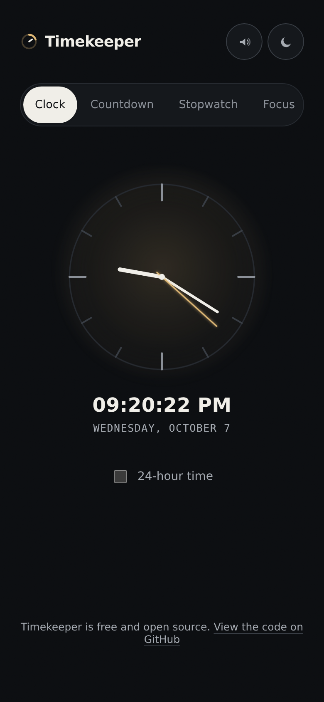

<p align="center">
  
</p>

<h1 align="center">Timekeeper</h1>

<p align="center">A clock, countdown, stopwatch, focus timer, and alarms in one quiet instrument.</p>

<p align="center">
  <a href="https://github.com/babatundeawo/timekeeper/actions/workflows/deploy.yml"></a>
  <a href="https://github.com/babatundeawo/timekeeper/actions/workflows/codeql.yml"></a>
</p>

<p align="center">
  <a href="https://babatundeawo.github.io/timekeeper/">Live site</a> ·
  <a href="docs/CUSTOMIZING.md">Documentation</a> ·
  <a href="https://github.com/babatundeawo/timekeeper/issues">Report an issue</a>
</p>

<p align="center">
  
</p>

## About

Timekeeper puts the time tools you reach for every day behind one calm interface. It runs entirely in your browser, stores nothing on a server, and works offline once installed. Every mode shares one brass ring that sweeps, fills, or empties to show progress.

## Features

- **Clock**: analog face with a digital readout, date, and an optional 24-hour display.
- **Countdown**: quick-start chips (5, 10, 15, 25, 45 minutes), manual hours, minutes and seconds, saved custom presets, and a +1:00 button while running.
- **Stopwatch**: start, pause, reset, and lap recording with hundredths of a second.
- **Focus**: Pomodoro cycles with adjustable focus, short break, long break and round count. Phases advance automatically.
- **Alarms**: set a time, a label and repeat days. A ringing alarm takes over the screen with Stop and Snooze (5 minutes).
- Light and dark themes that follow your system and remember your choice.
- Sound mute, keyboard shortcuts, and installation as an app on desktop and mobile.

Timers keep running when you switch modes or move to another tab. Settings, presets and alarms are saved in your browser on your device.

## How to use it

1. Open the [live site](https://babatundeawo.github.io/timekeeper/) and pick a mode from the row of tabs.
2. Press **Start** on Countdown, Stopwatch or Focus. On a keyboard, `Space` starts or pauses, `R` resets, `L` records a lap, and `1` to `5` switch modes. Arrow keys move between tabs.
3. To install, use the **Install app** button in the header, or your browser's install option (Safari: File > Add to Dock; iOS and Android: Add to Home Screen).

Alarms ring only while Timekeeper is open in a browser tab or the installed window. The site has no server, so it cannot wake a closed app.

## Tech stack

- Plain HTML, CSS and JavaScript with no runtime dependencies
- Geist and Geist Mono from Google Fonts
- Web Audio, Notifications and Service Worker APIs
- GitHub Actions and GitHub Pages for checks and hosting

## Project structure

```
site/                  The website exactly as it is served
├── index.html         Page markup and metadata
├── css/style.css      Design tokens and styles
├── js/app.js          Modes, timers, alarms and install prompt
├── js/theme-init.js   Applies the saved theme before first paint
├── service-worker.js  Offline caching
├── manifest.json      Web app manifest
└── icons/             Favicon, app icons and social preview image
docs/                  Guides for maintaining the site
.github/workflows/     Deployment, link checks, Lighthouse and CodeQL
```

## Contributing

Bug reports and ideas are welcome through [GitHub issues](https://github.com/babatundeawo/timekeeper/issues). See [CONTRIBUTING.md](CONTRIBUTING.md) for how to propose a change.

## Security

Report vulnerabilities privately as described in [SECURITY.md](SECURITY.md).

## Credits

Typefaces: [Geist and Geist Mono](https://vercel.com/font) by Vercel, licensed under the SIL Open Font License 1.1. Icons and the logo are drawn for this project.

Maintainer guides: [Deployment](docs/DEPLOYMENT.md) · [Customizing](docs/CUSTOMIZING.md)
